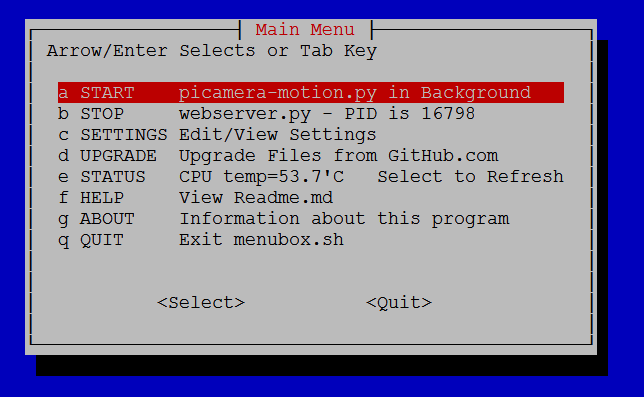
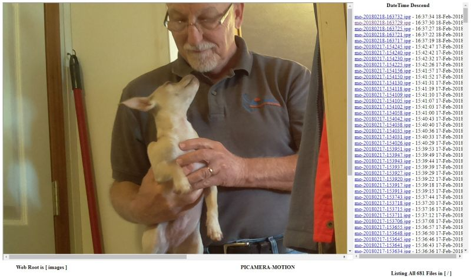

#  Lightweight python Motion Detection

## Description
Based on original code written by brainflakes and modified by pageauc
user utpalc rewrote motion detection using picamera stream and pageauc
modified this sample code to this example application
This code uses the picamera python libraries rather than raspistill.
Posted on Raspberry Pi forum under Lightweight Python Motion Detection
Sample video posted at http://youtu.be/ZuHAfwZlzqY
Code modified to exit image scanning loop as soon as the sensitivity value
is exceeded. This speeds taking larger photo if motion detected early in scan
Code is python3 compatible.
This project is available on github at https://github.com/pageauc/picamera-motion

***Note:*** This is sample code to assist development. For a full feature app
see my pi-timolo GitHub repo at https://github.com/pageauc/pi-timolo

## How To Install
Log in to RPI using putty ssh or raspberry pi console terminal session.
Prior to install it is recommended you run

    sudo apt-get update
    sudo apt-get upgrade

Cut and Paste curl command below into RPI console/Putty SSH session.

    curl -L https://raw.github.com/pageauc/picamera-motion/master/install.sh | bash

Press enter key to run the install.sh bash script.  This will download files, install
dependencies and change permissions as appropriate.

## How To Test Run

    cd ~/picamera-motion
    ./picamera-motion.py

Confirm camera and program motion detection per logging messages. Trouble shoot as required.

## How to Run menubox.sh
Use menubox.sh menu picks to Edit settings.py as well as Start/Stop picamera-motion.py
and/or webserver.py in Background as pi user. (when running PID will be displayed).

    ./menubox.sh

## How to View Images
Use menubox.sh to START webserver menu pick (PID will be displayed).
This will run webserver.py as a pi user background task using default 8080 port per settings.py
Access the web page from a LAN (Local Area Network) computer/device web browser per
URL displayed by webserver menu pick message.

Example

    http://192.168.1.150:8080

Replace ip address above with a valid entry for your system.  Note multiple
ip addresses may be displayed by menubox.sh message when you START webserver from menu pick
To view web page image(s) select a link from right pane web page listing.   

Use browser refresh to update listing. Auto refresh can be enabled in settings.py
per

    web_page_refresh_on = True
    web_page_refresh_sec = "180"

Default refresh frequency is 180 seconds.  You can change this as required.  Note
seconds value MUST be in quotes. See other webserver variables per comments.

## How To Change Settings
You can edit setting using menubox.sh EDIT menu pick or
edit settings.py using nano or python IDLE.

    nano settings.py

ctrl x y to Save Changes and Exit nano

## How to Run On Boot
To start picamera-motion and/or webserver on startup

    sudo nano /etc/rc.local

Add the following as appropriate

    su pi -c "/home/pi/picamera-motion/picamera-motion.sh start"
    su pi -c "/home/pi/picamera-motion/webserver.sh start"

ctrl-x to exit and save changes

## How to Upload Images
Rclone can upload images to a Remote Storage Service of your choice
eg Google Drive, DropBox, Etc. For remote service name setup see
[wiki details](https://github.com/pageauc/rclone4pi/wiki#how-to-configure-a-remote-storage-service).

To Run rclone sync (You Must have a Remote Service Name Configured)

    ./rclone-sync.sh

Review output for further details or trouble shooting

## How to Automate Upload
Create a crontab entry to run rclone-sync.sh regularly

    sudo crontab -e

Add/Edit the following entry.  Will run every 5 minutes as pi user

    */5 * * * * su pi -c "/home/pi/picamera-motion/rclone-sync.sh" > /dev/null 2>&1

ctrl-x y to exit and save changes

That's it
Please note this code is pretty basic but a good learning tool if
you need to implement a simple python only motion detection application
using the picamera python libraries.

Claude Pageau